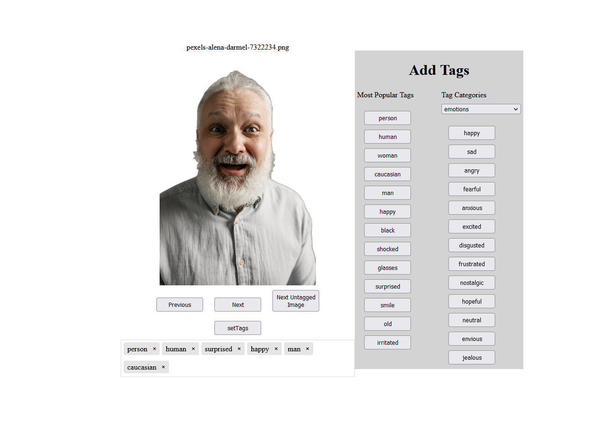

# Image Tagging
I created this tool because I needed to manually tag a few hundred images and I couldn't find a tool to do exactly what i wanted. 

This adds the tags to the images exif data and into a local sqlite database.

# Requirements
download [exiftool](https://exiftool.org/) and add it to PATH or this projects root folder

```pip install flask, pyexiftool```

# Usage
- run ```flask --app main run``` and visit 127.0.0.1:5000 in a browser

- You can add your own tags into the tag-box or select tags from the most popular tags aswell as some categories
- You can define your own categories with available tags in ```saved_tags.json```


